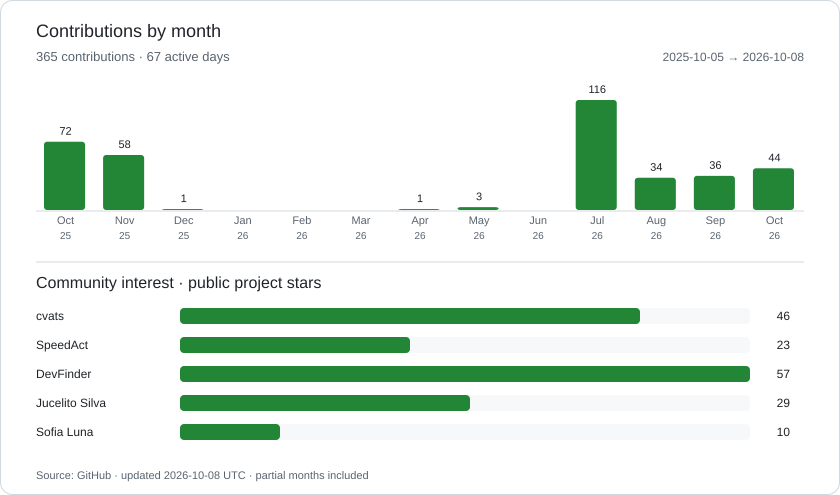

# Renato Khael

**Head of Chapter · Software Engineer · Frontend Architecture**

I build web products and the engineering foundations behind them. My work connects technical leadership, frontend architecture, performance and developer experience. Based in Brazil, with 10+ years in software engineering.

[Portfolio](https://renatokhael.com) · [LinkedIn](https://www.linkedin.com/in/rkhael/) · [Open-source projects](https://github.com/rntxbr?tab=repositories&type=source)

## Focus

- **Engineering leadership:** mentoring, chapter development, architecture and engineering quality.
- **Frontend:** React, Next.js, Vue.js, Nuxt, TypeScript and design systems.
- **Performance:** rendering, bundle optimization and legacy modernization.
- **OTT & streaming:** Web, Android, iOS, Roku and Smart TV.

## Selected experience

| Company | Role | Period |
| :--- | :--- | :--- |
| **OVERLABS** | Head of Chapter · OTT & Streaming | Dec 2025–present |
| **Reply** | Staff Frontend Engineer | Jul–Nov 2025 |
| **Opsteam / Linx** | Senior Frontend Developer | Jan–Jul 2025 |
| **Luizalabs / Netshoes** | Frontend Developer | Jun–Dec 2024 |
| **QuintoAndar** | Software Engineer I–III | Oct 2021–Dec 2023 |

At OVERLABS, I lead 4 Chapter Leads and support 20+ engineers. Previous work includes frontend standardization at Reply, ERP modernization at Linx and performance engineering at Luizalabs. Earlier roles include ATTA, InstaCarro and Somai EdTech.

**Education:** MBA in IT Management · Systems Analysis and Development, Anhanguera Educacional.

Stack and engineering practices

- **Web:** JavaScript, TypeScript, React, Next.js, Vue.js, Nuxt, Astro, Tailwind CSS.
- **Backend & data:** Node.js, NestJS, GraphQL, PostgreSQL, MongoDB.
- **Quality & delivery:** Jest, Cypress, Git, Docker, CI/CD, accessibility and responsive interfaces.

## Open source

| Project | Purpose | Stack |
| :--- | :--- | :--- |
| [**cvats**](https://github.com/rntxbr/cvats-app) | ATS resume builder and analyzer with PDF export, live preview and job-description matching. [Try it](https://cvats.com.br). | Next.js · React · TypeScript |
| [**SpeedAct**](https://github.com/rntxbr/lib-speedact) | React component performance monitoring and render metrics. | React · TypeScript |
| [**DevFinder**](https://github.com/rntxbr/devfinder-app) | GitHub profile search with repository insights. | JavaScript · GitHub API |
| [**Jucelito Silva**](https://github.com/rntxbr/astro-theme-jucelito-silva) | Developer portfolio theme with blog and responsive layouts. | Astro · React · Tailwind CSS |
| [**Sofia Luna**](https://github.com/rntxbr/astro-theme-sofia-luna) | Customizable developer portfolio and blog theme. | Astro · React · TypeScript |

## GitHub activity

<picture>
  <source media="(prefers-color-scheme: dark)" srcset="./assets/activity-dark.svg">
  
</picture>

Updated daily from GitHub. Contributions follow GitHub's visibility and counting rules. Stars show community interest, not code quality. Partial months are included. [Native contribution graph and activity](https://github.com/rntxbr#user-activity-overview).

## Em português

Sou engenheiro de software e Head of Chapter, com foco em liderança técnica, arquitetura frontend e performance. Desenvolvo produtos web e projetos open source com React, Vue.js e TypeScript. Conheça minha trajetória no [portfólio](https://renatokhael.com) ou converse comigo pelo [LinkedIn](https://www.linkedin.com/in/rkhael/).
